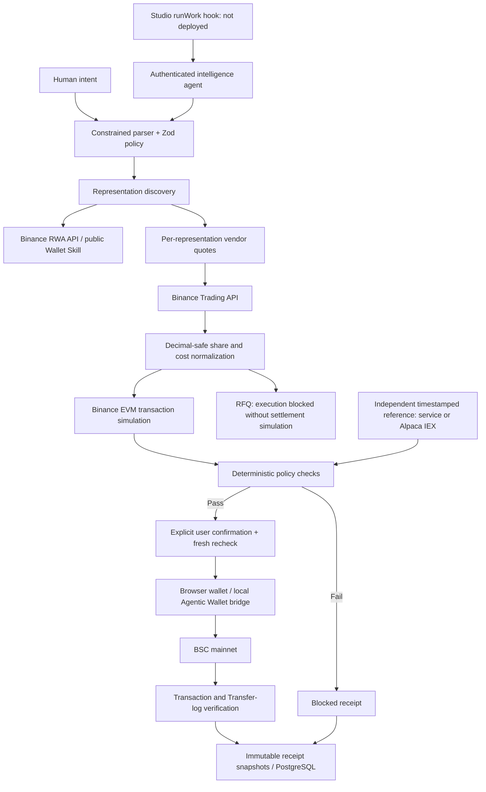

# ATLAS

**One intent. Every market. Best execution.**

[Guía integral del proyecto en español](docs/ATLAS_PROJECT_GUIDE.md): arquitectura, flujos, configuración, mejoras, evidencia y pasos para la primera operación real.

Autonomous Tokenized Liquidity & Allocation System — an execution workspace for tokenized equities on BNB Smart Chain, built for **BNB Hack: Tokenized Stocks Edition 2026**.

## Problem

One equity can have several on-chain representations. Token quantities are not directly comparable: issuer share multipliers, executable quotes, gas, trading restrictions, and reference freshness all matter. A cheap-looking token can be the wrong execution route.

## Solution

ATLAS compiles the user's chosen exposure into a deterministic policy, discovers representations, compares normalized net output, evaluates risk, simulates transactions, and produces an auditable receipt. It refuses execution when required evidence is absent.

The interface includes a command center, editable trade policy, Simulation Race, live markets, wallet balances, execution receipts, agent API console, system telemetry, and a guided judge walkthrough.

## Why ATLAS

- **Execution, not prediction:** the user chooses the stock and amount.
- **Comparable economics:** token quantities are converted to underlying shares using issuer multipliers. Gas is converted into the same unit before ranking.
- **Deterministic money controls:** no model generates transaction calldata or decides eligibility.
- **Evidence of refusal:** blocked trades receive receipts too.
- **Honest references:** a token-derived per-share price is never presented as an independent exchange quote. Missing source timestamps block freshness checks.

## Run locally

Node.js 24 and pnpm 10 are supported. From the repository root:

```sh
pnpm install
pnpm dev
```

Open http://localhost:3000/judge. No credentials are needed for the fictional simulation scenarios. The server selects explicit demo mode when both Binance credentials are absent.

For configuration, copy `.env.example` to root `.env.local`. Do not commit the latter. On Windows environments with a corporate CA, use Node's system trust store (`$env:NODE_OPTIONS='--use-system-ca'`); do not disable certificate verification.

## Demo

1. Open `/judge`, select **Best execution**, and click **Simulate routes**.
2. Inspect Ondo's fictional winning net share output, bStocks' valid alternative, and xStocks' rejected deviation.
3. Select **Policy block** and rerun. A 1 bps limit blocks every demo route.
4. Select **Stale reference** and rerun. The reference timestamp is deliberately old.
5. Inspect `/receipts`, expand individual checks, and export the JSON evidence.
6. Open `/markets`, search `NVDA`, and click **Live discovery · no API key**. This explicitly fetches real public Binance Wallet Skill data, separate from demo trading.

The additional simulation-failure scenario is available on `/trade`. Demo identifiers begin with `DEMO:` and cannot be broadcast as EVM addresses. Demo simulations do not count as external API telemetry.

## Architecture



Domain and integration code lives under `packages/`; Next.js owns the UI and HTTP boundary. The isolated `packages/agent/server.ts` process serves reports without wallet-signing capabilities. Session-scoped receipts use PostgreSQL via Drizzle; without `DATABASE_URL`, a bounded process-memory adapter is explicitly temporary. Live execution requires PostgreSQL.

## Execution flow

Intent → policy validation → BSC discovery → market/reference snapshot → quotes → normalization → simulation → hard policy filter → highest valid net output → receipt.

Live mode additionally requires an operator-enabled feature flag, verified USDT and router configuration, BSC chain verification, input and gas balances, fresh quote evidence, exact simulated token flows, explicit user confirmation, and user-controlled signing. A quote/simulation receipt cannot be promoted into a live transaction.

## Binance / BNB integrations

| Integration                              | Implementation                                                                                  | Verified runtime status                                                                                                                           |
| ---------------------------------------- | ----------------------------------------------------------------------------------------------- | ------------------------------------------------------------------------------------------------------------------------------------------------- |
| Public tokenized-securities Wallet Skill | Implemented: discovery, issuer metadata, per-asset status, dynamic market data                  | **WORKING**: real NVDA representations from Ondo, xStocks, bStocks retrieved on 2026-09-30; evidence in `docs/devex/live-discovery-evidence.json` |
| Authenticated RWA API                    | Implemented: search, token list, underlying market, prices                                      | **READ VERIFIED** on 2026-09-30 with local API credentials; evidence in `docs/devex/authenticated-read-evidence.json`                             |
| Market API                               | Implemented RWA price adapter                                                                   | **READ VERIFIED** on 2026-09-30 for NVDAon and NVDAB                                                                                              |
| Independent equity reference             | Generic HTTPS source or optional Alpaca IEX latest trade with source timestamp                  | **NOT CONFIGURED** locally; tests verify parsing and fail-closed behavior                                                                         |
| Trading API                              | Implemented quotes and SWAP construction; RFQ quotes retained                                   | **QUOTE + BUILD VERIFIED** on 2026-09-30 with an unfunded probe address; no signing or broadcast                                                  |
| Transaction API                          | Implemented exact-transaction simulation and predicted-flow checks                              | **API REACHED**: unfunded probe simulation returned a failed result; funded success is unverified                                                 |
| Wallet API                               | Implemented address balances                                                                    | **NOT VERIFIED**: no wallet address supplied                                                                                                      |
| Agentic Wallet                           | Implemented local status/balance/settings, preview, interactive SWAP execution and verification | **PARTIAL**: no authenticated wallet installed/configured in this session                                                                         |
| BNB Agent Studio                         | Implemented `runWork` report hook against the documented seller interface                       | **PARTIAL**: no generated seller deployment, ERC-8004 identity, or live ERC-8183 task                                                             |
| x402 / b402                              | Official V2 payment flow investigated; separate from core trade path                            | **NOT CONFIGURED / Planned**: payment serving is not implemented                                                                                  |

Configuration is not proof of a working integration. `/system` labels success only after measured successful requests. Public API availability and listed representations can change.

## Agentic Wallet

Follow [the official installation guide](https://developers.binance.com/en/docs/products/agentic-wallet/quickstart/install-agentic-wallet) and the [official skill](https://github.com/binance/binance-skills-hub/tree/main/skills/binance-web3/binance-agentic-wallet). The inspected skill specifies `@binance/agentic-wallet` and the `baw` CLI. Skill installation:

```sh
npx skills add binance/binance-skills-hub/skills/binance-web3/binance-agentic-wallet
```

Sign in through Binance's official interactive flow. Set `ATLAS_BAW_EXECUTABLE` to the absolute executable or JavaScript entrypoint. Windows shell wrappers are deliberately rejected; point to the installed CLI's JavaScript entrypoint instead.

```sh
pnpm wallet status
pnpm wallet balance
pnpm wallet settings
pnpm wallet trade policy.json
```

`trade` rebuilds a live policy report, checks chain and balances, previews the exact SWAP through Agentic Wallet, prints parsed transaction/risk evidence, and requires typing `EXECUTE`. It refuses expired previews, reported risks, failed simulations, and RFQs. Developer Mode must be enabled by the user in Binance; ATLAS never changes wallet security settings. An App confirmation may still be required by Binance. No raw private keys enter this application.

## BNB Agent Studio

See [docs/AGENT_STUDIO.md](docs/AGENT_STUDIO.md) for the verified install/scaffold/deploy workflow and integration hook. No Studio deployment or registration is claimed. The regular intelligence service works independently:

```sh
# Configure ATLAS_AGENT_TOKEN first (random, 32+ characters).
pnpm agent
```

It listens on loopback port 8080, exposes authenticated `POST /best-execution`, bounds concurrent work, and cannot broadcast. Both this endpoint and the web app's `POST /api/agent/best-execution` accept either a direct policy JSON (used by the Studio hook and built-in console) or `{ "policy": {...}, "wallet": "0x..." }` for wallet-bound quotes.

## Safety architecture

- Official signed endpoints only; HMAC uses the exact `/build` path and encoded query.
- Decimal strings and bigint for token amounts; conservative rounding for basis points.
- Final risk filters enforce tradability, independent reference, timestamp freshness, spot and execution deviation, price impact, slippage cap, gas availability, quote freshness, and simulation.
- Buy ranking is net underlying shares; sell ranking is net USDT proceeds. Sell routes must match the selected token holding.
- The mainnet cap compares the exact USDT input for buys; sells use the independent reference value of the selected holding.
- Simulated debits must match the input amount. Output must meet minimum receive. Unrelated token drains and allowance mutations fail.
- Pre-sign re-evaluation cannot silently change the chosen issuer/vendor or reduce output beyond the confirmed slippage policy.
- If allowance is missing, the user may prepare an exact-input ERC-20 approval. ATLAS validates Binance's approval calldata against the signed quote, checks the on-chain allowance and an operator-reviewed spender allowlist, and requires a separate wallet confirmation. A fresh quote and simulation are required after approval confirms.
- Signing is user controlled; unsigned transaction preparation is not called a completed trade.
- RPC verification matches sender, target, value, and calldata before recording chain confirmation. Reverted transactions disclose that gas may have been spent.
- Secrets stay server-side; telemetry records endpoint identifiers, timing and sanitized categories, never headers or signed payloads.
- HTTP receipts are scoped to a random HttpOnly, SameSite browser session. Production deployment still needs ingress rate limits; local process limits are not a distributed abuse-control service.

## Environment variables

All supported variables are in [.env.example](.env.example). Main requirements:

| Variable                                          | Obtain / configure                                                                                   |
| ------------------------------------------------- | ---------------------------------------------------------------------------------------------------- |
| `BINANCE_WEB3_API_KEY`, `BINANCE_WEB3_API_SECRET` | [Binance Web3 Developer Portal](https://web3.binance.com/en/dev-portal/project) project credentials  |
| `DATABASE_URL`                                    | Standard PostgreSQL connection string from your database provider                                    |
| `ATLAS_REFERENCE_URL`, `ATLAS_REFERENCE_TOKEN`    | Your licensed independent USD equity-reference service; timestamp contract in `docs/INTEGRATIONS.md` |
| `ALPACA_API_KEY_ID`, `ALPACA_API_SECRET_KEY`       | Optional [Alpaca Market Data](https://docs.alpaca.markets/us/reference/stocklatesttradesingle-1) IEX latest trade reference when no custom reference URL is set |
| `ATLAS_USDT_ADDRESS`, `ATLAS_USDT_DECIMALS`       | Operator-verified BSC USDT contract and token precision; no hard-coded example contract              |
| `ATLAS_ALLOWED_ROUTERS`                           | Operator-reviewed router contracts from verified official routes                                     |
| `BSC_RPC_URL`                                     | BSC mainnet JSON-RPC endpoint; default official public RPC                                           |
| `ATLAS_BAW_EXECUTABLE`                            | Local official Agentic Wallet executable/JS entrypoint                                               |
| `ATLAS_AGENT_TOKEN`                               | Locally generated random bearer secret, at least 32 characters                                       |
| `ATLAS_REPORT_URL`                                | Deployed HTTPS `/api/agent/best-execution` URL, for the Studio hook                                  |
| `ATLAS_LIVE_TRADING_ENABLED`                      | Defaults `false`; enabling alone does not bypass prerequisites                                       |

No LLM key is required. Unsupported natural-language clauses are rejected; users can edit the validated policy explicitly. This build does not contain a paid LLM adapter.

## Testing

```sh
pnpm typecheck
pnpm lint
pnpm test
pnpm exec playwright install chromium
pnpm test:e2e
pnpm build
```

With Binance credentials configured, `pnpm verify:authenticated` checks signed read endpoints. After setting an operator-reviewed BSC USDT contract and decimals, `pnpm verify:quote --simulate --approval` checks quote, exact-input approval calldata, unsigned SWAP build, and simulation endpoints with a random unfunded address. Set `ATLAS_QUOTE_PROBE_WALLET` only to a public address to bind the probe to that wallet. The probe never signs or broadcasts; a failed simulation with an unfunded address is expected and does not establish mainnet execution readiness. Sanitized evidence is written to `docs/devex/`.

`pnpm verify:reference` checks the configured independent price feed and its source timestamp against the default five-minute limit. It does not move funds. A stale result outside US stock trading hours is expected.

`pnpm verify:wallet <public-BSC-address> 10 [quote-approve-target]` reads BNB, USDT, the USDT contract's actual decimals, and optionally the exact spender allowance at one BSC block. It prints the public address and balances locally without saving them to the repository; it does not sign or broadcast.

Tests cover policy parsing, monetary precision, reference math, normalization, risk rejection, candidate isolation, simulation-only execution boundaries, official response schemas, and receipt ownership. Browser tests cover all eight pages at desktop/mobile widths, successful races, strict policy blocks, stale references, simulation failures, invalid input, and disconnected wallets. External calls are never represented by unit-test telemetry.

## Deployment

See [docs/DEPLOYMENT.md](docs/DEPLOYMENT.md). The web app is compatible with a Vercel pnpm monorepo project rooted at `apps/web`. Configure environment variables in the hosting provider, run the database migration, then deploy. No hosting account or deployment credentials were supplied, so this repository has **not been publicly deployed**.

## Developer experience evidence

`pnpm devex:export` exports actual recent runtime observations from a running app into `docs/devex/`. PostgreSQL stores observations captured alongside reports. The in-memory telemetry buffer is bounded; exports are not a complete lifetime archive. [docs/DEVELOPER_EXPERIENCE_NOTES.md](docs/DEVELOPER_EXPERIENCE_NOTES.md) is deliberately human-fillable with no invented opinions.

## Mainnet readiness

**NOT READY in the delivered environment.** Local API credentials passed authenticated read, quote, exact-input approval build, unsigned SWAP build, and simulation-endpoint checks. A persistent local PostgreSQL instance is configured and migrated; no production database is configured. At the BSC check on 2026-09-30 16:38 UTC, the supplied public wallet had zero USDT, zero BNB, and zero allowance for the quoted spender. An independent timestamped reference, operator-reviewed spender/router settings, a funded wallet, and a successful funded SWAP simulation remain outstanding. RFQ execution needs a supported settlement-simulation strategy and is blocked in this version. ATLAS can prepare a limited approval for explicit wallet confirmation; it never grants an allowance automatically.

Mainnet execution moves real assets. Review the route and confirm before proceeding. Tokenized securities may have issuer, liquidity, smart-contract, market-hours and jurisdictional risks.

## Hackathon

Target: [BNB Hack: Tokenized Stocks Edition 2026](https://www.bnbchain.org/en/hackathons/tokenized-stocks). The live public-data path genuinely discovers supported tokenized equities; the demo path remains fictional. Prize eligibility, full deployment, identity registration, and real execution must be demonstrated with actual evidence before submission.
