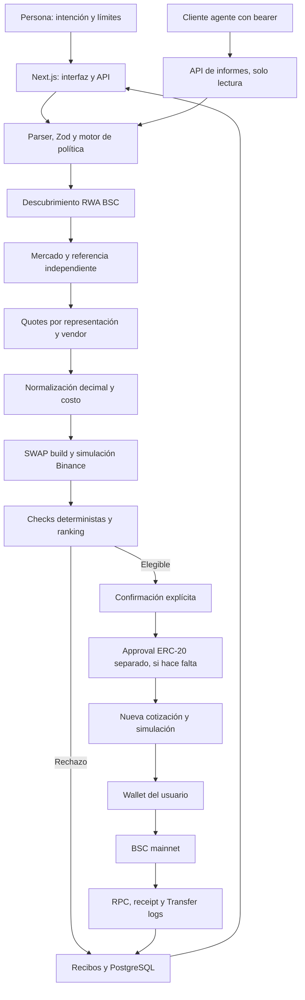

# ATLAS: guía integral del proyecto

**Versión del repositorio:** `0.1.0` · **Corte de esta guía:** 1 de octubre de 2026 · **Red:** BNB Smart Chain mainnet, `chainId=56`.

Este archivo reúne el objetivo, el comportamiento implementado, la arquitectura, los flujos, las integraciones, la operación, las pruebas y los pendientes de ATLAS. Describe el código del repositorio en la fecha indicada. Los precios, saldos, cotizaciones, estados de mercado y disponibilidad de servicios cambian: cada operación debe obtener evidencia nueva. Los datos ficticios de demostración nunca equivalen a una transacción real.

## Índice

1. [Qué es ATLAS y qué alcance tiene](#1-qué-es-atlas-y-qué-alcance-tiene)
2. [Estado real y objetivo inmediato](#2-estado-real-y-objetivo-inmediato)
3. [Arquitectura y mapa del repositorio](#3-arquitectura-y-mapa-del-repositorio)
4. [Modelo de datos, unidades y modos](#4-modelo-de-datos-unidades-y-modos)
5. [Flujo completo de evaluación](#5-flujo-completo-de-evaluación)
6. [Política y controles de riesgo](#6-política-y-controles-de-riesgo)
7. [Aprobación, ejecución y verificación en BSC](#7-aprobación-ejecución-y-verificación-en-bsc)
8. [Interfaz y API HTTP](#8-interfaz-y-api-http)
9. [Integraciones externas](#9-integraciones-externas)
10. [Persistencia y observabilidad](#10-persistencia-y-observabilidad)
11. [Configuración y puesta en marcha](#11-configuración-y-puesta-en-marcha)
12. [Pruebas, evidencia y despliegue](#12-pruebas-evidencia-y-despliegue)
13. [Mejoras realizadas y trabajo pendiente](#13-mejoras-realizadas-y-trabajo-pendiente)
14. [Guía para la primera operación real](#14-guía-para-la-primera-operación-real)
15. [Referencias y glosario](#15-referencias-y-glosario)

## 1. Qué es ATLAS y qué alcance tiene

ATLAS significa **Autonomous Tokenized Liquidity & Allocation System**. Es un espacio de análisis y ejecución para representaciones tokenizadas de acciones en BSC, desarrollado para **BNB Hack: Tokenized Stocks Edition 2026**. Su lema es _One intent. Every market. Best execution._ El usuario elige la acción, el lado, el importe y los límites. ATLAS descubre representaciones de distintos emisores, compara rutas ejecutables en unidades equivalentes, aplica reglas deterministas, simula y produce un recibo auditable. Solo una operación aprobada y confirmada por la persona llega a su wallet para firmarse.

El problema central es que **un token no siempre equivale a una acción**. Cada representación trae su propio multiplicador de acciones por token, estado de negociación, precio, liquidez, ruta y costo. Comparar únicamente la cantidad de tokens o el precio mostrado produciría decisiones erróneas. ATLAS normaliza la exposición a acciones subyacentes para compras y los USDT netos para ventas, descontando el costo USD disponible.

### Capacidades presentes

- Compra en USDT y venta de un token específico que la wallet ya posee; comparación de Ondo, bStocks y xStocks cuando los datos oficiales devuelven esas representaciones.
- Política estructurada y un parser deliberadamente limitado para texto en inglés; edición explícita de límites en la interfaz.
- Descubrimiento público y autenticado, cotizaciones por representación y proveedor, referencia bursátil independiente, simulación de SWAP, selección o rechazo con motivos individuales.
- Demostración ficticia reproducible, consulta de cartera, recibos, telemetría, API de informes para agentes y un puente local opcional hacia Binance Agentic Wallet.
- Preparación de aprobación ERC-20 limitada al importe exacto, transacción SWAP sin firmar, envío desde la wallet del usuario y verificación posterior de la transacción y sus eventos `Transfer`.

### Límites funcionales actuales

- ATLAS **no elige inversiones ni predice precios**. Tampoco implementa un adaptador LLM pago: el parser rechaza cláusulas desconocidas.
- Una cotización o un recibo `simulated` **no mueve fondos**. El estado `confirmed` solo se crea tras consultar BSC; se distingue además si los flujos de tokens coincidieron.
- RFQ puede aparecer entre las cotizaciones, pero su firma/liquidación y simulación de settlement no están implementadas. Las rutas RFQ quedan excluidas de ejecución.
- La integración BNB Agent Studio es un hook `runWork`; no hay despliegue, identidad ERC-8004 ni tarea ERC-8183 demostrada. b402/x402 no sirve informes de pago en esta versión.
- La aplicación web no está desplegada públicamente. La base PostgreSQL configurada es local; no existe aún infraestructura de producción documentada como operativa.

## 2. Estado real y objetivo inmediato

**Objetivo acordado:** primera prueba de **compra de NVDA por 10 USDT en BSC mainnet**, usando **Alpaca IEX** como fuente bursátil independiente. Se proporcionó una dirección pública de wallet para las verificaciones, pero esta guía no la guarda: las verificaciones locales aceptan la dirección como argumento. Nunca se necesitan frases semilla ni claves privadas en este repositorio.

| Componente                            | Estado verificado hasta el 01-10-2026                                                                         | Lo que demuestra                                                 |
| ------------------------------------- | ------------------------------------------------------------------------------------------------------------- | ---------------------------------------------------------------- |
| Binance Wallet Skill público          | Funcionó para NVDA; encontró Ondo, xStocks y bStocks.                                                         | Descubrimiento y datos públicos, sin ejecución.                  |
| API Binance RWA y Market autenticadas | Lecturas de NVDAon y NVDAB con claves locales.                                                                | Firma y parsing de lectura reales.                               |
| Binance Trading                       | Cotizaciones SWAP de ambas representaciones, construcción de SWAP sin firmar y calldata de aprobación exacta. | Integración de cotización y construcción; no una compra.         |
| Binance Transaction                   | Endpoint de simulación respondió; la simulación con wallet sin fondos falló.                                  | Conectividad, no simulación exitosa de wallet financiada.        |
| BSC RPC                               | `chainId=56`; el router observado tenía bytecode.                                                             | Existencia de contrato, no auditoría ni aprobación del operador. |
| Referencia Alpaca IEX                 | Adaptador y pruebas locales implementados; **faltan las dos credenciales**.                                   | No hay llamada real ni precio independiente fresco comprobado.   |
| Wallet de la prueba                   | En la lectura del **30-09-2026 16:38 UTC**: 0 USDT, 0 BNB y allowance 0 al spender consultado.                | Foto temporal de saldo; debe repetirse antes de operar.          |
| PostgreSQL                            | Contenedor PostgreSQL 16 local activo y migración aplicada.                                                   | Persistencia local; no base gestionada de producción.            |
| Trading real                          | **No habilitado ni ejecutado**. `ATLAS_LIVE_TRADING_ENABLED=false`; allowlist vacía.                          | Ninguna transacción de ATLAS transmitida.                        |

La cotización observada usó `LiquidMesh` y mostró `0xB44446b0c8E56988c34f7Ff73Ae904982b5FdDA5` como router/spender. El endpoint firmado de Binance devolvió una aprobación que coincidió byte por byte con `approve(spender, 10 × 10^18)` codificado localmente. Se confirmó bytecode en BSC; **la procedencia del contrato no quedó verificada de forma independiente**. Una consulta Sourcify v2 no encontró registro verificado en esa fecha. Por eso `ATLAS_ALLOWED_ROUTERS` sigue vacío y requiere revisión humana del operador. La dirección de USDT observada en BSC fue `0x55d398326f99059fF775485246999027B3197955`, con 18 decimales; confirmar contrato y precisión antes de habilitar operaciones.

Las instantáneas sanitizadas están en [descubrimiento público](devex/live-discovery-evidence.json), [lecturas autenticadas](devex/authenticated-read-evidence.json) y [cotización/simulación/aprobación](devex/authenticated-quote-evidence.json). Ninguna evidencia contiene firma de wallet ni hash de una operación ATLAS confirmada.

## 3. Arquitectura y mapa del repositorio



La **frontera de confianza** está entre el motor de informes y la firma. Binance proporciona datos, cotizaciones, construcción y simulación. ATLAS valida y prepara; la wallet del usuario autoriza `eth_sendTransaction` o el CLI oficial ejecuta tras su confirmación. El servicio de inteligencia y el hook de Studio no disponen de claves ni endpoint de broadcast.

| Ruta                                                            | Responsabilidad principal                                                               |
| --------------------------------------------------------------- | --------------------------------------------------------------------------------------- |
| [`apps/web/`](../apps/web/)                                     | Next.js 16, React 19, Tailwind 4, interfaz, rutas HTTP y wallet inyectada en navegador. |
| [`packages/core/domain.ts`](../packages/core/domain.ts)         | Esquemas, tipos, conversiones raw/decimal y unidades.                                   |
| [`packages/core/policy.ts`](../packages/core/policy.ts)         | Parser de intención con gramática acotada.                                              |
| [`packages/core/risk.ts`](../packages/core/risk.ts)             | Reglas de elegibilidad y motivos por ruta.                                              |
| [`packages/core/router.ts`](../packages/core/router.ts)         | Orquesta candidatos, normalización, simulación, ranking y recibo.                       |
| [`packages/market/`](../packages/market/)                       | Adaptadores demo, público, autenticado, referencia y cartera.                           |
| [`packages/binance-web3/`](../packages/binance-web3/)           | Cliente firmado, esquemas Zod y errores de API.                                         |
| [`packages/execution/`](../packages/execution/)                 | Gate de mainnet, aprobación, preparación, wallet local y verificación en BSC.           |
| [`packages/agent/`](../packages/agent/)                         | Servicio de evaluación, servidor de informes y hook de Studio.                          |
| [`packages/db/`](../packages/db/)                               | Drizzle/PostgreSQL, migración y modo de memoria temporal.                               |
| [`packages/telemetry/index.ts`](../packages/telemetry/index.ts) | Observaciones sanitizadas de API.                                                       |
| [`scripts/`](../scripts/)                                       | Migración, exportación, verificación externa y CLI de wallet.                           |
| [`tests/`](../tests/)                                           | Pruebas unitarias y Playwright.                                                         |
| [`docs/`](./)                                                   | Runbooks, contratos de integración y evidencia.                                         |

Es un monorepo pnpm 10.32.1/TypeScript 5.9.2. El paquete web usa Next.js 16.3.6 y React 19.3.0. Zod valida límites y respuestas; `decimal.js` evita cálculos monetarios con floats; `viem` codifica ERC-20 y consulta BSC; Drizzle y `postgres` guardan los recibos. La raíz declara Node.js 24 como entorno soportado en el [README](../README.md).

## 4. Modelo de datos, unidades y modos

### Entidades

| Entidad          | Campos y sentido                                                                                                                                                                   |
| ---------------- | ---------------------------------------------------------------------------------------------------------------------------------------------------------------------------------- |
| `Policy`         | `ticker`, `side`, `amount` decimal positivo, `denomination`, límites en bps, edad máxima de referencia, opt-in de referencia vieja, `executionMode` y `sellTokenAddress` opcional. |
| `TradeIntent`    | Política con `id`, hora de creación y texto original opcional.                                                                                                                     |
| `Representation` | Ticker, emisor (`ondo`, `bstocks`, `xstocks` o `unknown`), contrato BSC, símbolo, decimales, `sharesPerToken`, tradabilidad, estado, hora de observación y flag demo.              |
| `Market`         | Precio por token on-chain, hora fuente de ese precio, valor derivado por acción, referencia independiente por acción y su hora fuente, estado/horario y hora de observación.       |
| `Quote`          | Vendor, `SWAP`/`RFQ`, tokens de entrada/salida, spender, montos humanos y raw, decimales, precios USD, costo USD, impacto, límite de slippage, hora y caducidad.                   |
| `Simulation`     | Éxito, tipo `demo`/`binance`/`unavailable`, error y transacción exacta si existe.                                                                                                  |
| `Evaluation`     | Una representación y una cotización, checks, rechazo/elegibilidad, salida neta, acciones brutas, precio ejecutable, desviación y duración.                                         |
| `Receipt`        | Intención, candidatos, ruta elegida, decisión, estado, evidencia de cadena, motivo y línea temporal. Se guardan snapshots sucesivos.                                               |

`Policy.amount` es una **cadena decimal**, no un `number`. Una compra siempre denomina el importe en **USDT**; una venta, en **TOKEN** y debe apuntar al contrato que se posee. `toRaw` multiplica por `10^decimals` y rechaza una precisión imposible; `fromRaw` invierte esa conversión. Los puntos básicos (`bps`) equivalen a centésimas de punto porcentual: 50 bps = 0,5 % y 100 bps = 1 %. Los cálculos monetarios usan precisión decimal de 60 dígitos; montos raw y saldos usan `bigint`.

Para **compra**, `grossShares = expectedAmountOut × sharesPerToken`; el precio de ejecución por acción se obtiene de importe y valor USD de entrada dividido por acciones brutas. `netOutput = grossShares − gasUsd / referencePrice`. Para **venta**, el precio de ejecución relaciona la salida en USDT con las acciones del token vendido; `netOutput = expectedAmountOut − gasUsd / outputPriceUsd`. Solo candidatos con salida neta positiva y todos los checks obligatorios aprobados entran al ranking. Gana la mayor salida neta. La documentación oficial de Binance define `tradeFee` como costo de red estimado en USD; se mapea a `gasUsd` y se descuenta una sola vez. No se presenta como desglose completo de todas las comisiones del emisor o del venue.

### Modos de datos y ejecución

| Modo       | Selección y alcance                                                                                                                                                                                                        |
| ---------- | -------------------------------------------------------------------------------------------------------------------------------------------------------------------------------------------------------------------------- |
| Demo       | `ATLAS_DEMO_MODE=true`, `auto` sin ambas credenciales, o selección explícita **Fictional demo** en `/judge`. Datos ficticios, multiplicadores distintos y contratos `DEMO:*`; se rechaza `executionMode=live`. |
| Público    | `ATLAS_DEMO_MODE=false` sin ambas credenciales. Descubrimiento Wallet Skill real; las cotizaciones autenticadas faltan y no hay ejecución. En `/markets` puede forzarse `source=public` incluso si el modo normal es otro. |
| Live data  | `ATLAS_DEMO_MODE=false` con ambas credenciales. Datos y quotes oficiales; `LIVE DATA` no significa que esté habilitado el broadcast.                                                                                       |
| `quote`    | Valida mercado, referencia y quote; omite simulación. Produce estado `quoted` si hay ruta válida.                                                                                                                          |
| `simulate` | Agrega construcción/simulación del SWAP; estado `simulated` si pasa. Es el modo inicial de la interfaz.                                                                                                                    |
| `live`     | Evalúa como `simulate` y habilita preparación solo si `ATLAS_LIVE_TRADING_ENABLED=true` y todos los gates posteriores pasan. Requiere consentimiento y firma separados.                                                    |

En el demo hay cuatro escenarios: `successful-best-execution`, `policy-block` (límite de 1 bps), `stale-reference` y `simulation-failure`. El escenario se ignora en datos reales. En demo, Ondo y bStocks pueden competir, xStocks excede el desvío de ejemplo, y las simulaciones son locales. La página `/judge` usa este flujo para explicar aprobaciones y rechazos.

## 5. Flujo completo de evaluación

1. **Captura de intención.** El texto se transforma mediante una gramática explícita o se envía una `Policy` JSON. Zod comprueba ticker, monto, unidades, rangos y modo. Cláusulas desconocidas, repetidas o porcentajes con precisión excesiva se rechazan.
2. **Descubrimiento.** El adaptador obtiene representaciones BSC del ticker. Una búsqueda de compañía ambigua que devuelva tickers distintos se bloquea hasta elegir ticker exacto. Los datos públicos y autenticados filtran activos y cadenas ajenas.
3. **Mercado.** Para cada token se lee estado, precio por token y hora fuente. El dato tokenizado derivado por acción se mantiene separado de la referencia bursátil independiente. En live, la referencia se pide al servicio HTTPS configurado o a Alpaca IEX.
4. **Cotización.** Para compra se solicita USDT → token; para venta, token seleccionado → USDT. Se convierte el monto a la precisión exacta del token. La API exige dirección receptora de wallet. Las respuestas se validan contra contrato, monto, decimales, honeypot y tax rate. Un vendor inválido queda excluido sin descartar automáticamente otros candidatos.
5. **Normalización.** Cada vendor se convierte a acciones subyacentes o USDT netos y precio por acción. Un costo USD desconocido impide comparar la salida neta de manera confiable.
6. **Simulación.** Para cada SWAP se construye la transacción con el `quoteId` y límites de la política; ATLAS confirma tokens, montos, receptor, `minReceiveAmount` y slippage. Binance simula la transacción EVM exacta. Debe mostrar débito exacto de entrada, crédito mínimo de salida, ninguna mutación de allowance y ningún drenaje adicional de tokens.
7. **Checks.** La política evalúa cada candidato. Un fallo del servicio, una simulación fallida o una referencia ausente se refleja en el candidato y su recibo. Las representaciones se procesan en lotes de tres; los vendors de cada representación se evalúan en secuencia. Se revisa otra vez la caducidad de cotizaciones al terminar.
8. **Decisión.** La ruta elegible con mejor salida neta genera recibo `quoted` o `simulated`; si ninguna pasa, `blocked`. Ambos casos quedan registrados. Ninguna evaluación por sí sola firma ni mueve fondos.

La cotización live tiene una ventana local conservadora de **25 segundos** desde que empieza la solicitud. Es una protección de ATLAS, no una promesa de vigencia externa. El código exige volver a evaluar si expira o si quedan menos de tres segundos antes de firmar.

## 6. Política y controles de riesgo

Ejemplo de política estructurada para la prueba prevista:

```json
{
  "ticker": "NVDA",
  "side": "buy",
  "amount": "10",
  "denomination": "USDT",
  "maxSlippageBps": 50,
  "maxReferenceDeviationBps": 100,
  "maxReferenceAgeSeconds": 300,
  "allowWhenReferenceStale": false,
  "executionMode": "simulate"
}
```

La frase reconocida sigue el patrón `Buy $10 of NVIDIA. Maximum slippage 0.5%. Maximum reference deviation 1%.` o venta de tokens. Límites omitidos: 50 bps de slippage, 100 bps de desviación y 300 segundos de edad de referencia. Rangos: slippage 0–500 bps, desviación 0–1000 bps, referencia 1–86 400 segundos. El texto tiene máximo 2 000 caracteres y la política puede editarse en la UI. `allowWhenReferenceStale=true` permite edad superior al límite, pero sigue exigiendo timestamp válido y todos los demás checks.

| Check                   | Criterio que impone el código                                                                                                                               |
| ----------------------- | ----------------------------------------------------------------------------------------------------------------------------------------------------------- |
| `ONCHAIN_FRESHNESS`     | Timestamp fuente del precio tokenizado entre −5 y 120 segundos respecto del reloj actual. Un timestamp de petición no reemplaza al de precio.               |
| `TRADABLE`              | Representación marcada negociable y estado conocido que no sea pausa/halt.                                                                                  |
| `REFERENCE`             | Precio USD positivo por acción de fuente independiente. El precio derivado del token no lo satisface.                                                       |
| `FRESHNESS`             | Hora fuente de referencia presente y no más de 5 segundos en el futuro; edad dentro del límite salvo opt-in explícito.                                      |
| `DEVIATION`             | Máximo entre desviación spot y desviación de ejecución, ambos por acción, dentro de `maxReferenceDeviationBps`. Se redondea conservadoramente hacia arriba. |
| `QUOTE` / `QUOTE_FRESH` | Salida positiva, edad entre −5 y 30 segundos y caducidad vigente; el adaptador Binance usa una ventana conservadora de 25 segundos. |
| `SLIPPAGE` / `IMPACT`   | Slippage configurado e impacto cotizado no exceden el límite. Impacto desconocido bloquea.                                                                  |
| `COST`                  | Costo USD conocido y no negativo para calcular salida neta.                                                                                                 |
| `HOLDING`               | En venta, el contrato de la ruta coincide con `sellTokenAddress`; no se canjean holdings de emisores distintos por equivalencia aparente.                   |
| `SIMULATION`            | En `simulate` y `live`, la transacción exacta tiene simulación exitosa. No se exige en `quote`. RFQ queda bloqueado aquí.                                   |
| `MARKET_CLOSED`         | Advertencia, no aprobación implícita ni fallo automático; la vigencia real de referencia sigue siendo obligatoria.                                          |

Además de los checks de ruta, el **gate de mainnet** exige flag live, confirmación explícita, datos live, modo `live`, recibo aprobado, simulación Binance exitosa con transacción exacta y máximo USD. En compra se compara el importe **exacto de USDT indicado por el usuario** con `ATLAS_MAX_TRADE_USDT` (10 por defecto). En venta se usa el valor de las acciones del holding al precio de referencia. No se infla el cap con el precio USD que el vendor asigne a USDT.

## 7. Aprobación, ejecución y verificación en BSC

### Aprobación ERC-20, solo cuando hace falta

Si todos los checks salvo `SIMULATION` pasan y existe un `approveTarget` de SWAP, la UI puede solicitar `POST /api/approval/prepare`. Eso no demuestra que la allowance sea la causa del fallo: el servidor vuelve a comprobarla. Realiza una **nueva evaluación en modo `quote`**, verifica todos los checks que no requieren simulación, el cap, contrato/decimales, BSC `56`, saldo de entrada, BNB, allowance actual, bytecode del spender y su inclusión en `ATLAS_ALLOWED_ROUTERS`. Pide a Binance el calldata firmado de `approve-transaction` y lo compara contra la codificación local `approve(spender, amountInRaw)`; exige una sola ruta SWAP y aprobación **exacta** del monto de entrada. Calcula gas estimado con 20 % de margen.

Si la allowance ya alcanza, responde `already-approved`. Si falta, devuelve una transacción ERC-20 **sin firmar** con monto, spender y token visibles. La UI requiere una casilla de autorización separada, comprueba wallet y red `0x38`, y deja la firma a la wallet. Después del minado verifica sender, destino, calldata y allowance on-chain y obliga a obtener **quote y simulación nuevos**. Un approval confirmado no garantiza que el SWAP siguiente vaya a pasar o conservar el mismo precio. PostgreSQL conserva preparación, hash y estado en `token_approvals`; `sessionStorage` permite retomar la consulta en la pestaña.

### Envío del SWAP

La UI presenta el recibo ganador y pide otra confirmación de operación real. `POST /api/execute` solo acepta el ID de un recibo de la misma sesión, la wallet y `confirmed: true`. Vuelve a evaluar en vivo y rechaza si cambia el contrato de representación o el vendor, o si la salida baja más que el slippage confirmado. `prepareTransaction` comprueba otra vez política, cap, `tx.from`, router en allowlist y con bytecode, RPC en `56`, balance de token de entrada, estimación de gas y BNB con margen del 20 %, y caducidad. PostgreSQL registra una `execution claim` única para esa intención, evitando preparaciones duplicadas.

Solo entonces se devuelve `transaction` sin firmar a la wallet. El navegador usa `eth_sendTransaction` con `chainId=0x38`; el CLI Agentic Wallet, si está instalado y autenticado, usa preview y una confirmación literal `EXECUTE`, además de las confirmaciones propias de Binance. ATLAS no custodia llaves ni modifica Developer Mode. No hay ruta del servidor que envíe fondos por sí misma.

### Estado posterior

`POST /api/execute/verify` consulta el hash por RPC. Antes de minar crea un snapshot `pending` verificable luego. Al minar compara **sender, target, value y calldata** con la transacción preparada. Lee eventos ERC-20 `Transfer` de los contratos de entrada y salida: el débito neto debe ser exactamente `amountInRaw` y el crédito al menos el mínimo permitido por slippage. Una transacción exitosa en BSC puede quedar con `verification=mismatch` si los flujos difieren; `executed=true` indica éxito de cadena, no conformidad económica. Un revert queda `reverted` y puede haber consumido BNB en gas. Los recibos verificados se guardan como snapshots nuevos y enlazan a BscScan.

## 8. Interfaz y API HTTP

### Páginas disponibles

| Página       | Uso                                                                                                                                                               |
| ------------ | ----------------------------------------------------------------------------------------------------------------------------------------------------------------- |
| `/`          | Centro de mando, intención, política, carrera de rutas y resultado.                                                                                               |
| `/trade`     | Mismo flujo de trading en página dedicada, incluyendo approval y confirmación live cuando corresponda.                                                            |
| `/markets`   | Busca ticker/compañía, muestra emisor, contrato, multiplicador, precio y estado; permite descubrimiento público explícito.                                        |
| `/portfolio` | Lee balances de BSC de la dirección conectada vía Wallet API autenticada; calcula exposición y distribución para holdings reconocidos. En demo no inventa saldos. |
| `/receipts`  | Lista, filtros por ticker/decisión/proveedor/fecha, detalles de checks, exportación JSON y actualización de pendientes.                                           |
| `/agent`     | Estado del servicio de informes, guía de wallet local, consola bearer y diagrama de arquitectura.                                                                 |
| `/system`    | Modo, preparación, base de datos, integraciones y observaciones medidas. Configurado no equivale a llamada exitosa.                                               |
| `/judge`     | Visita guiada con escenarios ficticios y enlaces a evidencia; en live los fixtures no se aplican.                                                                 |

El navegador conserva la dirección conectada y transacciones pendientes en `sessionStorage`. La cookie `atlas_session` es UUID aleatorio, `HttpOnly`, `SameSite=Strict`, dura 30 días y usa `Secure` bajo HTTPS. Se usa para aislar recibos y preparaciones, no como autenticación fuerte de identidad de wallet. La UI conecta con una wallet EIP-1193 inyectada, solicita cuenta y verifica chain/account antes de firmar.

### API de Next.js

Implementada en [`apps/web/app/api/[...path]/route.ts`](../apps/web/app/api/%5B...path%5D/route.ts). Todas las respuestas JSON llevan `Cache-Control: no-store`. Los POST admiten cuerpo máximo de 12 KB, comprueban `Origin` cuando existe y limitan 20 peticiones por minuto y sesión **en memoria del proceso**. Las validaciones Zod devuelven error 400; las de integración usan códigos específicos. Para producción se requieren límites compartidos en el ingreso.

| Método y ruta                                        | Entrada o salida principal                                                                        | Restricción                                                                 |
| ---------------------------------------------------- | ------------------------------------------------------------------------------------------------- | --------------------------------------------------------------------------- |
| `GET /api/health`                                    | Salud, modo y timestamp.                                                                          | Pública.                                                                    |
| `GET /api/system/status`                             | Persistencia, readiness, integraciones, telemetría reciente.                                      | Pública; no expone secretos.                                                |
| `GET /api/markets?q=NVDA` / `GET /api/markets/NVDA`  | Representaciones y mercado; `source=public` fuerza Wallet Skill.                                  | Lectura; máximo 60 fichas por respuesta.                                    |
| `GET /api/receipts`                                  | Últimos recibos del navegador; indica si persistencia es temporal.                                | Cookie de sesión.                                                           |
| `GET /api/executions/{receiptId}`                    | Snapshot concreto.                                                                                | Cookie propietaria.                                                         |
| `GET /api/portfolio?address=0x...`                   | Balances y resumen; primera página de hasta 100 activos.                                          | Dirección EVM válida y API Wallet autenticada fuera de demo.                |
| `POST /api/intent/parse`                             | `{ "text": "Buy $10 of NVIDIA..." }` → política.                                                  | Parser acotado.                                                             |
| `POST /api/routes/evaluate` / `/api/routes/simulate` | `{ "policy": {...}, "wallet": "0x...", "scenario": "..." }` → recibo.                             | Wallet necesaria para quotes reales; ambos paths usan la misma evaluación.  |
| `POST /api/agent/best-execution`                     | Política directa o `{ "policy": {...}, "wallet": "0x..." }` → informe.                            | Bearer `ATLAS_AGENT_TOKEN` de 32+ caracteres; prohíbe `executionMode=live`. |
| `POST /api/approval/prepare`                         | `{ "policy": {...}, "wallet": "0x..." }` → allowance suficiente o approval exacto sin firmar.     | Live habilitado, credenciales, PostgreSQL y gates de quote.                 |
| `POST /api/execute`                                  | `{ "receiptId": "UUID", "wallet": "0x...", "confirmed": true }` → SWAP sin firmar y execution ID. | Modo live, cookie propietaria, recheck fresco y PostgreSQL.                 |
| `POST /api/execute/verify`                           | `{ "executionId": "UUID", "transactionHash": "0x..." }` → snapshot pending/confirmed/reverted.    | Claim de la misma sesión y transacción que coincida.                        |

El servicio independiente `pnpm agent` escucha `127.0.0.1:8080` por defecto, con `GET /health` y `POST /best-execution` bearer. Límite: tres trabajos simultáneos, 12 KB de solicitud y timeout de 30 segundos. Para acceso remoto necesita proxy HTTPS autenticado; no posee endpoint de firma.

## 9. Integraciones externas

### Binance Web3 y Wallet Skill

El cliente autenticado llama a `https://web3.binance.com/build`. La firma es **HMAC-SHA256 Base64** de `timestamp + METHOD + /build/path?queryCodificada + cuerpoJSONExacto`; se envían `X-OC-APIKEY`, `X-OC-TIMESTAMP`, `X-OC-NONCE` y `X-OC-SIGN`. Cada intento regenera timestamp/nonce. Se verifican estado HTTP, envelope de negocio y esquema Zod. Hay timeout de 10 s y hasta tres intentos solo para red/timeout/429/5xx, con `Retry-After` acotado. La telemetría registra endpoint, resultado y duración sin secretos ni payload firmado.

| Integración          | Endpoint o interfaz implementada                                 | Función                                                                                   |
| -------------------- | ---------------------------------------------------------------- | ----------------------------------------------------------------------------------------- |
| RWA autenticado      | `/api/v1/dex/market/rwa/tokens`, `/search`, `/underlying-market` | Activos BSC, ticker, multiplicador, emisor y estado.                                      |
| Market autenticado   | `/api/v1/dex/market/rwa/price`                                   | Precio del token y hora fuente; valor derivado por acción no es referencia independiente. |
| Trading              | `/api/v1/dex/aggregator/quote`, `/swap`, `/approve-transaction`  | Quotes wallet-bound, SWAP sin firmar, calldata de allowance.                              |
| Transaction          | `/api/v1/dex/pre-transaction/simulate`                           | Simula el EVM tx exacto y reporta cambios de saldo/allowance.                             |
| Wallet               | `/api/v1/dex/balance/all-token-balances-by-address`              | Cartera por dirección, cadena 56, primera página.                                         |
| Wallet Skill público | `www.binance.com/bapi/defi/.../rwa/...`                          | Lista, metadata, estado y datos dinámicos sin key; no reemplaza Trading.                  |

El listado público se cachea durante 60 segundos por proceso y limita la consulta a 30 representaciones; agrupa solicitudes de tres. Una respuesta pública puede ofrecer precio `stockInfo` sin timestamp fuente. Se muestra como indicación pública con hora no verificada; la referencia independiente queda marcada como no disponible. No satisface la verificación de frescura ni prueba independencia bursátil. El adaptador público hereda los métodos de quote autenticados, de modo que sin claves una evaluación real no podrá cotizar.

### Referencia independiente

Orden de preferencia: `ATLAS_REFERENCE_URL` HTTPS con esquema propio; si no está, Alpaca IEX cuando existen **ambas** credenciales. El servicio propio recibe `?ticker=NVDA`, bearer opcional y debe responder `ticker`, `currency: "USD"`, `price` decimal positivo **por acción**, `timestamp` ISO de la fuente, `source` e `independent: true`. No se sustituye la hora fuente por la hora de consulta. Alpaca usa `/v2/stocks/{ticker}/trades/latest?feed=iex`, comprueba símbolo y exchange `V` y toma `trade.t` como timestamp. Si está fuera del horario bursátil, un último trade antiguo puede ser correcto como dato, pero fallar la política de 300 s. La referencia ausente o inválida bloquea; la suscripción y el uso permitido de datos corresponden al operador.

### Wallet y agentes

- **Browser wallet:** firma directa del usuario por EIP-1193; ATLAS entrega datos de transacción ya validados.
- **Binance Agentic Wallet:** CLI oficial `baw` optativo, enlazado con `ATLAS_BAW_EXECUTABLE` absoluto. Lee status, dirección, balance y ajustes; preview exige Developer Mode activado por la persona. Rechaza riesgos reportados o simulación inválida y exige escribir `EXECUTE`. En Windows no ejecuta wrappers `.cmd`, `.bat` o `.ps1`: requiere entrypoint JS o ejecutable real.
- **BNB Agent Studio:** [`studio-hook.ts`](../packages/agent/studio-hook.ts) implementa `runWork(prompt, {sessionId})`, acepta política JSON, prohíbe live y devuelve un informe validado. Debe integrarse en un seller generado por Studio; Studio conserva sus propias funciones de escrow y firma. [Guía de integración](AGENT_STUDIO.md).
- **b402/x402:** investigado y documentado; no existe endpoint de cobro ni settlement de informes en este repo. El servicio de informes usa bearer, no pagos.

Para Agentic Wallet, instalar la [skill oficial](https://github.com/binance/binance-skills-hub/tree/main/skills/binance-web3/binance-agentic-wallet) con `npx skills add binance/binance-skills-hub/skills/binance-web3/binance-agentic-wallet`, iniciar sesión mediante su flujo oficial y consultar `pnpm wallet status`, `balance` y `settings`. El comando `pnpm wallet trade policy.json` espera que la allowance necesaria ya exista: el CLI de ATLAS no incorpora la preparación de approval que sí ofrece la web. Studio requiere generar un workspace vendedor separado con `bag init`, integrar allí `runWork`, configurar `ATLAS_REPORT_URL`/bearer y ejecutar `bag doctor`, `bag deploy prepare`, `bag deploy` y `bag deploy verify` con infraestructura propia. La documentación inspeccionada pedía Node 22+ y el helper de deploy Bun 1.3+; verificar requisitos vigentes antes de instalar. Los endpoints b402 V2 investigados fueron `/api/v2/b402/supported`, `/verify` y `/settle`; ninguno está conectado al flujo de trading.

El detalle de endpoints, contratos de respuesta y fuentes oficiales vive en [INTEGRATIONS.md](INTEGRATIONS.md).

## 10. Persistencia y observabilidad

Con `DATABASE_URL`, Drizzle usa PostgreSQL con pool máximo de cinco conexiones y prepared statements desactivados para compatibilidad con poolers. La migración SQL transaccional e idempotente crea:

| Tabla                | Contenido                                                          |
| -------------------- | ------------------------------------------------------------------ |
| `intents`            | Política original e ID, vinculada a owner.                         |
| `representations`    | Último snapshot por contrato de token.                             |
| `route_evaluations`  | Candidatos y checks asociados a intención.                         |
| `execution_receipts` | Snapshots de recibo, con índice por owner y fecha.                 |
| `executions`         | Claim único de transacción preparada, owner, recibo, vencimiento y hash de transacción vinculado una sola vez. |
| `token_approvals`    | Preparación, hash, estado y evidencia de approvals ERC-20 exactos. |
| `execution_holds`   | Bloqueos de revisión por wallet ante revert o mismatch de transacción/flujos. |
| `api_telemetry`      | Observaciones sanitizadas capturadas al guardar recibos.           |

El acceso HTTP a recibos y claims filtra por cookie `owner`; el servicio standalone utiliza owner `agent`, mientras el CLI usa `baw:<dirección>`. Sin `DATABASE_URL`, un `Map` global limitado a 500 recibos sirve desarrollo/demo y se pierde al reiniciar; **no se permite ejecución live sin PostgreSQL**. El listado de base devuelve como máximo 100 recibos recientes. Los snapshots de un mismo proceso son observables, pero no constituyen una cadena criptográfica de auditoría; la inmutabilidad aquí significa que cada estado se inserta con ID nuevo.

Las observaciones runtime guardan `module`, `operation`, hora, duración, HTTP, éxito, intento, error sanitizado y correlación. El buffer global conserva hasta 1 000 eventos y `/system` muestra los últimos 30. `pnpm devex:export` extrae lo que conoce el proceso web en ejecución hacia `docs/devex/`; no es archivo histórico completo ni una encuesta humana. Los fixtures demo y mocks de tests no cuentan como éxitos externos. [DEVELOPER_EXPERIENCE_NOTES.md](DEVELOPER_EXPERIENCE_NOTES.md) registra observaciones medidas, efectos, soluciones y mejoras propuestas, con enlaces a evidencia y sin opiniones humanas inventadas.

## 11. Configuración y puesta en marcha

### Variables de entorno

La plantilla completa es [`.env.example`](../.env.example). Copiar a `.env.local` en la raíz y conservar ese archivo fuera de Git. `.env.db` guarda la contraseña local de Docker. No enviar claves ni secretos por chat, capturas, logs o documentación.

| Variable                                          | Función y valor por defecto                                                                                        |
| ------------------------------------------------- | ------------------------------------------------------------------------------------------------------------------ |
| `NEXT_PUBLIC_APP_URL`                             | Origen de la app y control de `Origin`; ejemplo local `http://localhost:3000`.                                     |
| `NEXT_PUBLIC_GITHUB_URL`                          | Enlace opcional visible en el recorrido.                                                                           |
| `ATLAS_DEMO_MODE`                                 | `auto` por defecto; `true` fuerza demo; `false` intenta datos reales o fallback público.                           |
| `ATLAS_LIVE_TRADING_ENABLED`                      | `false` por defecto. El flag solo abre el flujo; no omite checks.                                                  |
| `ATLAS_MAX_TRADE_USDT`                            | Cap por operación; `10` por defecto.                                                                               |
| `BINANCE_WEB3_API_KEY`, `BINANCE_WEB3_API_SECRET` | Credenciales privadas del portal Binance Web3 para API firmada.                                                    |
| `DATABASE_URL`                                    | PostgreSQL server-side; obligatorio para live.                                                                     |
| `ATLAS_REFERENCE_URL`, `ATLAS_REFERENCE_TOKEN`    | Servicio HTTPS propio de referencia por acción; tiene precedencia sobre Alpaca.                                    |
| `ALPACA_API_KEY_ID`, `ALPACA_API_SECRET_KEY`      | Par privado para precio último trade IEX, si no hay URL propia.                                                    |
| `ATLAS_USDT_ADDRESS`, `ATLAS_USDT_DECIMALS`       | Contrato BSC revisado por operador y precisión; decimales default `18`, dirección sin default.                     |
| `ATLAS_QUOTE_PROBE_WALLET`                        | Dirección **pública** opcional para probe de quotes; sin ella se genera dirección aleatoria sin fondos.            |
| `BSC_RPC_URL`                                     | JSON-RPC BSC; default `https://bsc-dataseed.bnbchain.org`.                                                         |
| `ATLAS_ALLOWED_ROUTERS`                           | Contratos aprobados por operador, separados por coma; **sin default**. Cubre router de SWAP y spender de approval. |
| `ATLAS_AGENT_TOKEN`, `ATLAS_AGENT_PORT`           | Bearer aleatorio de al menos 32 caracteres y puerto local `8080`.                                                  |
| `ATLAS_REPORT_URL`                                | URL HTTPS del informe para el hook de Studio.                                                                      |
| `ATLAS_BAW_EXECUTABLE`                            | Ruta local absoluta del CLI oficial Agentic Wallet.                                                                |

**Arranque local:** instalar Node.js 24 y pnpm 10, ejecutar `pnpm install`, copiar `.env.example` a `.env.local` y luego `pnpm dev`. Abrir `http://localhost:3000/judge`. Para demo no se necesitan credenciales. En Windows con CA corporativa se puede usar el almacén del sistema con `$env:NODE_OPTIONS='--use-system-ca'`; nunca desactivar verificación TLS.

**PostgreSQL local:** colocar una contraseña generada como `POSTGRES_PASSWORD=...` en `.env.db`, configurar `DATABASE_URL=postgresql://atlas:<contraseña>@127.0.0.1:55432/atlas` en `.env.local`, ejecutar `docker compose up -d postgres` y `pnpm db:migrate`. [`compose.yaml`](../compose.yaml) usa PostgreSQL 16, volumen persistente y puerto limitado a loopback. No copiar esta URL local a producción.

### Comandos disponibles

| Comando                                                     | Uso                                                                                                                   |
| ----------------------------------------------------------- | --------------------------------------------------------------------------------------------------------------------- |
| `pnpm dev`, `pnpm build`, `pnpm start`                      | Desarrollo, build y arranque web.                                                                                     |
| `pnpm typecheck`, `pnpm lint`, `pnpm test`, `pnpm test:e2e` | Verificación estática, unitarias y navegador. Instalar Chromium con `pnpm exec playwright install chromium` si falta. |
| `pnpm db:migrate`                                           | Aplicar migración PostgreSQL.                                                                                         |
| `pnpm verify:public`                                        | Descubrimiento público NVDA y evidencia local.                                                                        |
| `pnpm verify:authenticated`                                 | Lecturas firmadas de RWA/Market.                                                                                      |
| `pnpm verify:quote --simulate --approval`                   | Quotes, construcción, simulación y validación de calldata con dirección de probe; **nunca firma ni transmite**.       |
| `pnpm verify:reference NVDA`                                | Lee fuente independiente y comprueba edad contra 300 s.                                                               |
| `pnpm verify:wallet <dirección-pública> 10 [spender]`       | Lee BNB, USDT, decimales y allowance en un mismo bloque; **solo lectura**.                                            |
| `pnpm devex:export`                                         | Exporta telemetría reciente desde app en ejecución.                                                                   |
| `pnpm agent`                                                | Servidor local de informes.                                                                                           |
| `pnpm wallet status`, `pnpm wallet balance`, `pnpm wallet settings`, `pnpm wallet trade policy.json` | CLI Agentic Wallet opcional; `trade` exige confirmación interactiva. |
| `pnpm verify:db` | Migraciones idempotentes, concurrencia, ownership y hashes únicos en una base desechable. |
| `pnpm inspect:router` | Inspección de router/spender y proxy; no autoriza contratos. |
| `pnpm verify:production --demo`, `pnpm verify:production` | Readiness de despliegue demo y live, respectivamente. |
| `pnpm verify:deployment https://HOST` | HTTP, ocho páginas, headers, salud de PostgreSQL y ownership de recibos demo. |
| `pnpm verify:studio`, `pnpm verify:secrets` | Hook externo de informes y escaneo de secretos conocidos en archivos/client bundle. |

## 12. Pruebas, evidencia y despliegue

El código cubre parser, precisión monetaria, referencia, normalización, checks, aislamiento de candidatos, esquemas oficiales, permisos, preparación, replay y verificación de ejecución. Hay pruebas de navegador para consentimiento separado del approval y demo explícito. Playwright usa desktop Chrome e iPhone 13 emulado con Chromium sobre un servidor de producción en puerto 3100; verifica las ocho páginas y los escenarios. `pnpm test:e2e` construye el build antes del recorrido. [FINAL_STATUS.md](FINAL_STATUS.md) conserva los comandos y resultados finales medidos. Estas pruebas no prueban una liquidación real.

La evidencia externa sanitizada de `docs/devex/` refleja observaciones puntuales del 01-10-2026; repetir probes antes de operar. `verify:quote` con dirección sin fondos alcanzó la API de simulación, pero la simulación falló y el comando devuelve `READINESS BLOCKED`. La Wallet API cuenta con evidencia de lectura del 01-10 a las 02:23 UTC, con cero activos; no demuestra fondos ni ejecución. Agentic Wallet sigue sin runtime autenticado. El estado “Configured · not verified” de `/system` significa exactamente eso.

Para despliegue, [DEPLOYMENT.md](DEPLOYMENT.md) describe Vercel con raíz `apps/web`, acceso al workspace superior, variables de entorno en el proveedor, PostgreSQL gestionado con TLS, migración, límites de ingreso y smoke checks. El remoto Git está configurado; falta un proyecto Vercel autenticado y una base gestionada. El build y el servidor local de producción se verifican por separado de un despliegue público. La persistencia de memoria y el rate limit por proceso no cubren múltiples instancias. El servicio standalone necesita proxy HTTPS autenticado. La [demostración para jueces](JUDGE_SCRIPT.md) distingue datos ficticios de pruebas reales.

## 13. Mejoras realizadas y trabajo pendiente

### Mejoras ya implementadas

- Adaptación a formas reales de respuestas firmadas de Binance y esquemas Zod; normalización de estados de mercado y protección ante datos parciales por vendor.
- Descubrimiento público genuino de Ondo/xStocks/bStocks y evidencias exportables, separado de cotizaciones autenticadas.
- Fuente de referencia independiente con servicio HTTPS o Alpaca IEX, timestamps de origen y bloqueo por ausencia/antigüedad.
- Cálculo decimal de acciones y salida neta; cap mainnet sobre USDT exacto; checks de desviación spot/ejecución y simulación de flujos.
- PostgreSQL local, migración idempotente, separación de owner, claims únicos y telemetría sanitizada.
- Revalidación inmediatamente antes de preparar SWAP; allowlist vacía por defecto, código on-chain, saldo/gas, límites y confirmación de wallet.
- Preparación de approval por monto exacto, comparación de calldata del proveedor con ERC-20 local, confirmación separada y nueva evaluación posterior.
- Probes de solo lectura para Binance, referencia, cotización y wallet, más prueba E2E del consentimiento de approval.

### Pendientes ordenados por dependencia

| Prioridad      | Trabajo y criterio de cierre                                                                                                                                                                                                                         |
| -------------- | ---------------------------------------------------------------------------------------------------------------------------------------------------------------------------------------------------------------------------------------------------- |
| 1 — referencia | Cargar ambas credenciales Alpaca en `.env.local`; `pnpm verify:reference NVDA` debe devolver `freshForDefaultPolicy=true` durante una ventana de mercado apropiada. Confirmar licencia/uso.                                                          |
| 1 — fondos     | Financiar la wallet de prueba con al menos 10 USDT y BNB suficiente para approval y SWAP; repetir `verify:wallet` porque la lectura del 30-09 ya no es garantía.                                                                                     |
| 1 — router     | Verificar por fuentes oficiales o auditoría propia contrato, spender, proxy/implementación, permisos y riesgos; solo entonces incluir la dirección revisada en `ATLAS_ALLOWED_ROUTERS`. Bytecode y quote firmada no prueban seguridad o procedencia. |
| 1 — ejecución  | Conseguir simulación exitosa con wallet financiada, quote fresca y consentimiento separado; verificar hash, receipt y Transfer logs. Guardar la evidencia real.                                                                                      |
| 2 — operación  | Despliegue HTTPS, PostgreSQL gestionado, backups, rate limits compartidos, alertas, logs/telemetría durables y revisión de seguridad antes de exposición pública.                                                                                    |
| 3 — rutas      | Implementar RFQ con firma, settlement y simulación/verificación compatibles con el protocolo oficial; probarlo antes de desbloquear RFQ.                                                                                                             |
| 3 — ecosistema | Desplegar Studio seller, verificar identidad ERC-8004 y tarea ERC-8183 real; decidir si b402/x402 aporta al servicio y, si se implementa, probar cobro y settlement.                                                                                 |

Además, la cookie de sesión protege la lectura por navegador, pero no demuestra propiedad criptográfica de la dirección consultada. Un despliegue público con cuentas, cartera privada o mayores montos requerirá un diseño explícito de autenticación de wallet, autorización, antiabuso y recuperación. No asumir que la demo o el límite local resuelven eso.

## 14. Guía para la primera operación real

Esta secuencia concreta responde al objetivo **comprar NVDA por 10 USDT**. No introducir claves por chat ni copiar la dirección de wallet al repositorio.

1. **Preparar datos.** Mantener las credenciales Binance existentes en `.env.local`; añadir `ALPACA_API_KEY_ID` y `ALPACA_API_SECRET_KEY`. Dejar `ATLAS_REFERENCE_URL` vacío si se quiere que gane Alpaca. Ejecutar `pnpm verify:reference NVDA` cuando el trade IEX pueda estar fresco.
2. **Verificar token y fondos.** Confirmar contrato USDT/18 decimales con fuentes del emisor/explorador y fijar `ATLAS_USDT_ADDRESS`, `ATLAS_USDT_DECIMALS=18`. Financiar la wallet con USDT y BNB; ejecutar `pnpm verify:wallet <dirección-pública> 10 [spender-verificado]`. Los saldos del 30-09 fueron cero.
3. **Revisar router/spender.** Contrastar la ruta devuelta por Binance con documentación oficial y análisis del contrato; revisar código/proxy, allowances y destinatario. Solo después rellenar `ATLAS_ALLOWED_ROUTERS`. No usar la dirección observada arriba como aprobación automática.
4. **Preparar persistencia.** Mantener PostgreSQL sano y `pnpm db:migrate` aplicado. Confirmar `/api/system/status`; el estado de base consulta todas las tablas requeridas. Las demás casillas de configuración no equivalen a simulación ni a evidencia de funcionamiento externo.
5. **Habilitar live de forma deliberada.** Fijar `ATLAS_DEMO_MODE=false`, `ATLAS_MAX_TRADE_USDT=10` y, tras los puntos anteriores, `ATLAS_LIVE_TRADING_ENABLED=true`. Reiniciar el servidor para cargar variables.
6. **Conectar wallet.** Abrir `/trade`, conectar la dirección financiada y comprobar red BSC mainnet `0x38`. Crear política `buy`, `NVDA`, `10`, `USDT`, `live`; revisar límites y datos de referencia. Ejecutar evaluación. Si no hay ruta aprobada, inspeccionar checks y resolver la causa; un rechazo es un resultado correcto.
7. **Allowance, si falta.** Usar “Check exact approval”; revisar token, spender y 10 USDT exactos. Confirmar en la wallet como transacción **separada**, esperar minado y pedir una nueva quote/simulación. Approval consume BNB y no compra NVDA por sí mismo.
8. **SWAP.** Revisar emisor, vendor, cantidad mínima, precio, desviación, gas y simulación exitosa; marcar confirmación de mainnet. La API reevalúa, prepara una única transacción y la wallet muestra la confirmación final. Rechazar en wallet cancela el envío.
9. **Comprobar resultado.** Guardar hash y recibo. `execute/verify` debe devolver estado `confirmed` **y** `verification=passed`; si queda `pending`, refrescar. Si sale `mismatch` o `reverted`, detener nuevas pruebas e investigar saldo, logs y gas. El primer hash real y la salida neta deben figurar en la evidencia antes de afirmar que la operación end-to-end está completa.

No se debe afirmar “mainnet listo” únicamente porque un flag se activó, el router tenga bytecode o una quote exista. Tampoco usar una simulación con wallet sin fondos como prueba de ejecución. La participación en hackathon y las restricciones de los valores tokenizados pueden tener requisitos propios de emisor, mercado y jurisdicción; revisar los aplicables antes de operar.

## 15. Referencias y glosario

### Documentación dentro del proyecto

- [README](../README.md): resumen, arranque y posicionamiento del producto.
- [INTEGRATIONS.md](INTEGRATIONS.md): endpoints Binance, contratos de datos, RFQ, referencia y fuentes.
- [DEPLOYMENT.md](DEPLOYMENT.md): despliegue web, PostgreSQL y release check.
- [AGENT_STUDIO.md](AGENT_STUDIO.md): integración opcional con seller generado.
- [JUDGE_SCRIPT.md](JUDGE_SCRIPT.md): recorrido de demostración.
- [DEVELOPER_EXPERIENCE_NOTES.md](DEVELOPER_EXPERIENCE_NOTES.md): informe de comportamiento medido y mejoras de integración.
- [FINAL_STATUS.md](FINAL_STATUS.md): resultados finales, checklist y acciones externas.

### Fuentes externas primarias

- [Binance Web3 RWA Data](https://web3.binance.com/en/dev-docs/catalog/web3-wallet/api/rest-api/rwa-data), [Trading API](https://web3.binance.com/en/dev-docs/catalog/web3-wallet/api/rest-api/trading-api), [Transaction API](https://web3.binance.com/en/dev-docs/catalog/web3-wallet/api/rest-api/transaction-api), [Wallet API](https://web3.binance.com/en/dev-docs/catalog/web3-wallet/api/rest-api/wallet-api) y [autenticación](https://web3.binance.com/en/dev-docs/authentication).
- [Binance Agentic Wallet](https://developers.binance.com/en/docs/products/agentic-wallet/quickstart/install-agentic-wallet), [BNB Agent Studio](https://www.bnbchain.org/en/bnb-agent-studio) y [BNB Smart Chain RPC](https://docs.bnbchain.org/bnb-smart-chain/developers/json_rpc/json-rpc-endpoint/).
- [Alpaca latest stock trade](https://docs.alpaca.markets/us/reference/stocklatesttradesingle-1) y [Market Data FAQ](https://docs.alpaca.markets/us/docs/market-data-faq).
- [BscScan USDT en BSC](https://bscscan.com/token/0x55d398326f99059ff775485246999027b3197955).

### Glosario mínimo

| Término                  | Significado aquí                                                                                                             |
| ------------------------ | ---------------------------------------------------------------------------------------------------------------------------- |
| Representación           | Contrato tokenizado de un emisor para exposición a una acción.                                                               |
| `sharesPerToken`         | Acciones subyacentes equivalentes por token; cambia la comparación económica.                                                |
| Quote                    | Cotización ejecutable de un vendor, con tokens, monto, impacto y caducidad.                                                  |
| SWAP / RFQ               | SWAP es transacción EVM construible/simulable aquí; RFQ necesita un flujo de firma/liquidación distinto aún no implementado. |
| Referencia independiente | Precio USD por acción de fuente separada del token, con timestamp de origen.                                                 |
| Allowance / approval     | Permiso ERC-20 para que un spender use un monto de token; puede consumir gas sin ejecutar la compra.                         |
| Recibo                   | Snapshot del motivo, candidatos, checks y, si procede, evidencia de cadena.                                                  |
| `verification=passed`    | La transacción coincide con la preparada y los eventos muestran débito/crédito esperados.                                    |

**Regla de actualización:** cuando cambien una integración, un control o el estado de mainnet, actualizar esta guía junto al código y adjuntar evidencia nueva con fecha. El estado histórico del apartado 2 no sustituye una verificación en el momento de operar.
